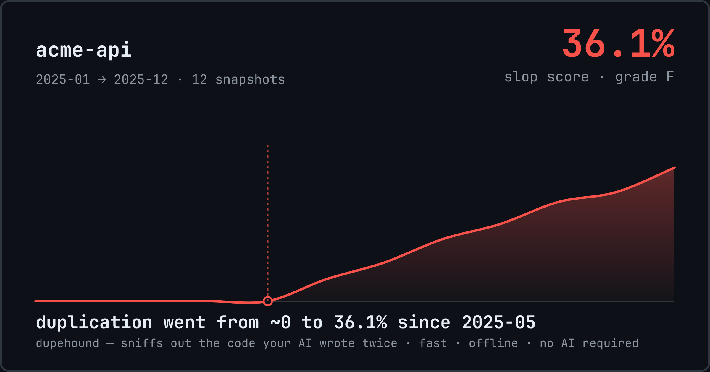

<p align="center">
  
</p>

<h1 align="center">dupehound 🐕</h1>

<p align="center"><b>Sniffs out the code your AI wrote twice.</b><br>
Fast, offline, deterministic — no API keys, no AI, no code leaves your machine.</p>

<p align="center">
  <a href="https://github.com/GITHUB_USER/dupehound/actions/workflows/ci.yml"></a>
  
  
</p>

---

AI coding agents are great at writing code and terrible at *remembering* it. An agent can't hold your whole repo in context, so it re-implements `formatDate` as `renderTimestamp`, then as `stringifyDate`, then as `humanizeDate` — same logic, new names, four places to fix the next bug. Industry analyses of millions of commits report code duplication has roughly **doubled** since AI assistants went mainstream, with copy-paste blocks growing ~8× while refactoring collapsed.

dupehound is the missing memory. It fingerprints the *structure* of every function in your codebase — like Shazam for code, immune to renamed variables and changed literals — and tells you, in seconds, what exists more than once, when the duplication started, and (in CI) the moment a new copy tries to sneak in.

```
$ dupehound scan .

  dupehound v0.1.0 — scanned 19 files · 370 lines · 27 functions in 21ms

  ╭─────────────────────────────────────────────────────────╮
  │  SLOP SCORE   36.1%   grade F                           │
  │  127 of 352 significant lines are deletable duplicates  │
  ╰─────────────────────────────────────────────────────────╯

  ● Cluster 1 ─ 4 copies · 100% similar · 42 deletable lines ─────────────
    ★ src/utils/date.ts:1        formatDate        14 lines
      src/api/timestamps.ts:1    renderTimestamp   14 lines   100% █████████
      src/jobs/report_dates.ts:1 stringifyDate     14 lines   100% █████████
      src/billing/dates.ts:1     humanizeDate      14 lines   100% █████████

  ★ = representative (kept) · dupehound scan --explain 1 shows the code
```

Works on **TypeScript, TSX, JavaScript, Python, Rust, Go and Java**, in any mix.

## The three commands

### `dupehound scan` — what exists twice, right now

Finds clusters of near-duplicate functions across the whole repo — even when every identifier and literal was renamed. Ranks them by deletable lines and computes the repo's **slop score**:

> **slop score** = the percentage of your code you could delete if every duplicate cluster kept only one copy.

That one sentence is the entire formula. The biggest copy in each cluster is exempt (the *original* isn't slop — the copies are), and test files don't count by default (table-driven tests are legitimately repetitive). Add `--json` for scripts, `--explain N` to print a cluster's code as proof, `--card` for a shareable score card.

### `dupehound history` — when the slop started

Replays your git history (one snapshot per month, no checkouts, no temp dirs) and charts duplication over time — then pinpoints the inflection:

```
$ dupehound history .

   36.1% ┤                      ██
         ┤                  ▂▂▆▆██
         ┤              ▂▂████████
         ┤          ▁▁████████████
    0.0% ┤          ██████████████
         └────────────────────────
          2025-01          2025-12

  current slop score: 36.1% (grade F)
  duplication went from ~0 to 36.1% since 2025-05

  card written → dupehound-card.svg / dupehound-card.png
```

It also renders the shareable card at the top of this README. If your duplication curve bends exactly when your team adopted coding agents — now you have the chart for *that* conversation. (dupehound only measures duplication; it never claims to know who or what wrote the code.)

### `dupehound check` — never let a new copy in

The CI / pre-commit gate. It indexes the codebase as of your base revision, then probes only the functions your change adds or touches:

```
$ dupehound check --diff main .
src/api/orders.ts:1 calculateOrderAmount() is a 100% duplicate of src/billing/invoice.ts:1 computeInvoiceTotal() — reuse it

dupehound check: 1 new duplicate of existing code
$ echo $?
1
```

Moved functions and in-place edits are recognized and never fire — the two classic CI false alarms. Output is one line per finding, written to be read by humans *and* by coding agents (see [Using with AI agents](#using-with-ai-agents)).

## Install

**Prebuilt binaries** (macOS, Linux, Windows) — grab the latest from [Releases](https://github.com/GITHUB_USER/dupehound/releases).

**Cargo:**

```sh
cargo install dupehound
```

**From source:**

```sh
git clone https://github.com/GITHUB_USER/dupehound && cd dupehound
cargo build --release   # binary at target/release/dupehound
```

Requires `git` on PATH for `history` and `check` (plain `scan` works anywhere, repo or not).

## How it works

No machine learning anywhere in the pipeline — this is the part senior engineers will want to audit, so here it is:

1. **Parse.** Every file goes through [tree-sitter](https://tree-sitter.github.io/); function and method *bodies* are the unit of comparison, so imports, signatures and license headers can never match.
2. **Normalize.** Identifiers → `ID`, string/char literals → `STR`, numbers → `NUM`, comments dropped. Keywords, operators and structure stay. Renaming everything (a type-2 clone) now produces an *identical* token stream.
3. **Fingerprint.** Rolling-hashed k-grams (k=10) are selected by **robust winnowing** — the algorithm behind Stanford's MOSS plagiarism detector ([Schleimer, Wilkerson & Aiken, SIGMOD 2003](https://theory.stanford.edu/~aiken/publications/papers/sigmod03.pdf)). Winnowing gives a mathematical guarantee: any shared run of **17+ normalized tokens** is always caught, and nothing shorter than 10 tokens can ever match. Our test suite asserts both properties.
4. **Match.** An inverted fingerprint index generates candidate pairs (no O(n²) all-pairs pass), ultra-common fingerprints — language boilerplate like Go's `if err != nil` ladders — are culled before they can pair everything with everything, similarity is exact Jaccard over fingerprint sets, and union-find groups pairs into clusters.
5. **Score.** The slop score formula above, printed under the score on every run.

Insertions and deletions only disturb fingerprints near the edit, so near-miss (type-3) clones surface naturally below the default 80% similarity bar — lower `--threshold` to dig.

## Why not just ask an LLM?

Honest question, since an LLM probably wrote the duplicates. Four reasons:

- **Exhaustiveness.** Finding duplicates means comparing every function against every other — effectively billions of comparisons in a large repo. A model samples what fits in context; an index checks *everything, every time*.
- **Determinism.** A CI gate that blocks merges must be reproducible and auditable: same input, same verdict, an algorithm you can read. You can't block a PR on a model's vibe.
- **Cost and speed.** dupehound scans ~3M lines in under 4 seconds, locally, for free, on every commit. An LLM pass over the same code costs real money and minutes — per run.
- **Privacy.** Your code never leaves the machine. There is nothing to configure, no API key to leak, nothing to send.

dupehound isn't anti-AI — it's the deterministic guardrail that makes agent-written code safe to merge fast. The agent writes; the hound checks.

## Honest by design

A duplicate detector lives or dies on false positives, so the defaults are conservative:

- **Test files** are scanned and labeled `[tests, not scored]`, but excluded from the slop score (override: `--include-tests` / `--exclude-tests`). Rust inline `#[cfg(test)] mod` blocks are detected too.
- **Generated and vendored code** is skipped: `@generated` / `DO NOT EDIT` markers, `*.pb.go`, `*_pb2.py`, `*.min.js`, `*.d.ts`, lock-step dirs like `node_modules/`, `vendor/`, `dist/`, `target/` — even when not gitignored (`--no-default-excludes` to override).
- **Tiny functions can't match**: 40-token minimum (`--min-tokens`), so getters and one-liner builders don't flood the report.
- **Every match is verifiable in one command**: `dupehound scan --explain N` prints the cluster's code side by side. If you disagree with a match, you can see exactly why it fired.
- **No attribution claims.** dupehound measures duplication. It does not — and cannot — know whether a human or a model wrote it.

## Calibration

Grades are calibrated against well-maintained open-source repos (scanned June 2026):

| Repo | Language | Lines | Slop score | Grade |
|---|---|---:|---:|:-:|
| expressjs/express | JavaScript | 21k | 0.0% | A |
| gin-gonic/gin | Go | 24k | 0.2% | A |
| tokio-rs/tokio | Rust | 175k | 1.1% | A |
| tiangolo/fastapi | Python | 109k | 1.7% | A |
| microsoft/vscode | TypeScript | 2.97M | 2.8% | A |

A < 3% · B < 6% · C < 10% · D < 15% · F ≥ 15%. Healthy, human-curated codebases land comfortably in A. If your repo doesn't, the report shows exactly which functions to merge.

## Performance

Single binary, parallel from disk to report. Measured on an M-series laptop:

| Codebase | Lines | Functions | Time |
|---|---:|---:|---:|
| tokio | 175k | 3,137 | 0.12s |
| fastapi | 109k | 1,758 | 0.19s |
| **vscode** | **2,970,884** | **53,375** | **3.6s** |

`history` reuses fingerprints across snapshots (cached by blob SHA), so charting 36 months costs only a few times more than one scan — not 36×.

## CI recipe

```yaml
# .github/workflows/dupehound.yml
name: dupehound
on: pull_request
jobs:
  check:
    runs-on: ubuntu-latest
    steps:
      - uses: actions/checkout@v4
        with:
          fetch-depth: 0   # check needs the merge-base
      - name: Install dupehound
        run: |
          curl -sL https://github.com/GITHUB_USER/dupehound/releases/latest/download/dupehound-x86_64-unknown-linux-gnu.tar.gz | tar xz
          sudo mv dupehound /usr/local/bin/
      - name: Block new duplicates
        run: dupehound check --diff origin/${{ github.base_ref }} .
```

## Using with AI agents

The `check` output is designed to be fed straight back to the agent that caused it. Add this to your `CLAUDE.md` / `AGENTS.md`:

```markdown
Before committing, run `dupehound check .` — if it reports that a function
you wrote duplicates existing code, delete your version and reuse the
original at the reported location.
```

Now the agent has a memory of the codebase it can actually query — and the duplicates stop at the door instead of piling up for the next refactor.

## Roadmap

- More languages: C/C++, C#, Ruby, PHP, Kotlin, Swift (tree-sitter makes each one ~a query file)
- Containment matching (small function copied *into* a big one)
- `--fix` suggestions: pick the import path that replaces a duplicate
- Editor integrations

Contributions welcome — see [CONTRIBUTING.md](CONTRIBUTING.md).

## License

MIT. Bundled [JetBrains Mono](https://www.jetbrains.com/lp/mono/) subsets are under the [SIL OFL 1.1](assets/fonts/OFL.txt).
