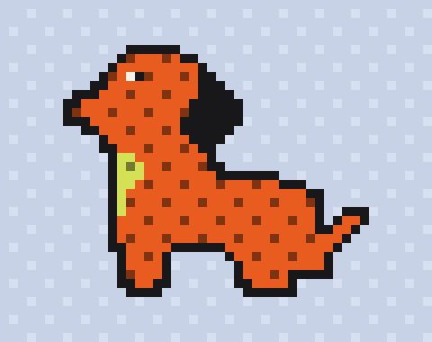
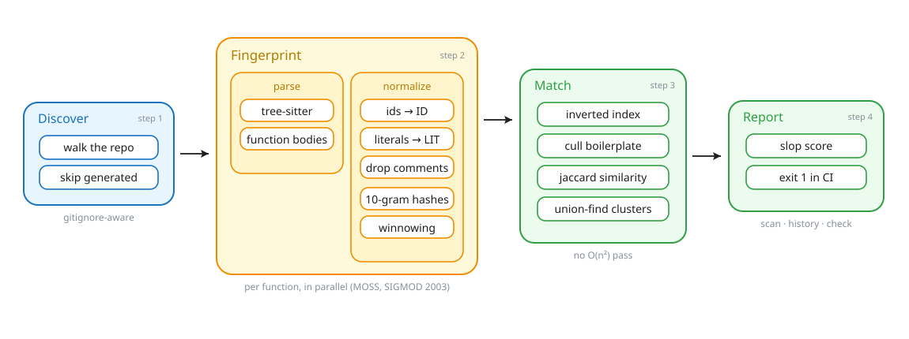
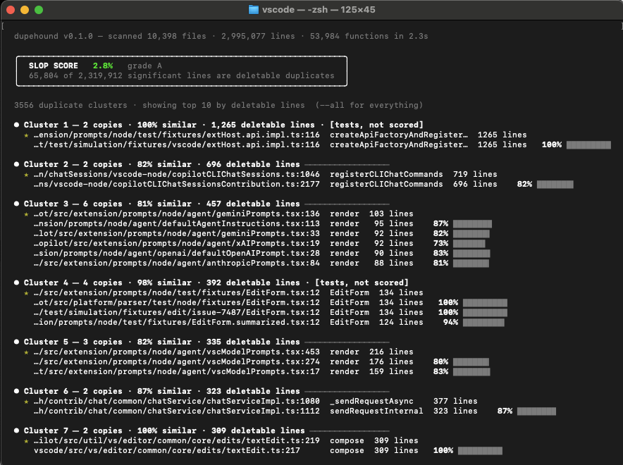
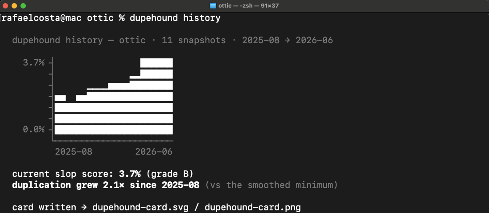

<p align="center">
  
</p>

<h1 align="center">dupehound</h1>

<p align="center">Finds functions duplicated by AI, even after every identifier is renamed.</p>

<p align="center">
  <a href="./LICENSE"></a>
  
  <a href="https://github.com/Rafaelpta/dupehound/actions/workflows/ci.yml"></a>
  <a href="./LICENSE"></a>
  <a href="https://github.com/Rafaelpta/dupehound/stargazers"></a>
</p>

dupehound is a duplicate-code detector built for codebases where agents write most of the code. It finds functions that exist more than once, even after every identifier and literal has been renamed, because it fingerprints the structure of the code instead of its text.

| Command | What it does |
|---------|--------------|
| `scan` | reports every duplicate cluster and a repo-level slop score |
| `history` | charts duplication across the git log and pinpoints when it took off |
| `check` | fails CI when a change duplicates code that already exists, naming the original to reuse |

Everything runs locally and deterministically (no network, API keys, or AI required).

<p align="center">
  
</p>

## Install

Prebuilt binaries for macOS, Linux and Windows are on the [releases page](https://github.com/Rafaelpta/dupehound/releases), or:

```
cargo install dupehound
```

On macOS or Linux with Homebrew:

```
brew install rafaelpta/dupehound/dupehound
```

`history` and `check` require `git` on PATH. `scan` works on any directory.

## Usage

### `scan`

`dupehound scan [path]` ranks duplicate clusters by deletable lines:

<p align="center">
  
</p>

The slop score is the percentage of code you could delete if every cluster kept only one copy; the largest copy is exempt and test files are excluded by default, since table-driven tests are repetitive by design.

<ul>
<li><code>--explain N</code> prints a cluster's code as proof</li>
<li><code>--json</code> emits a versioned schema</li>
<li><code>--card</code> writes a score card as SVG and PNG</li>
<li><code>--include-classes</code> flags C# classes with near-duplicate property and method signatures (experimental, opt-in, never affects the slop score)</li>
</ul>

Languages: TypeScript, TSX, JavaScript, Python, Rust, Go, Java, Ruby, Swift, C, C++, PHP, C#.

### `history`

`dupehound history` measures the slop score at monthly snapshots, reading blobs straight from the object database (no checkouts), and reports when duplication took off:

<p align="center">
  
</p>

### `check`

`dupehound check` gates CI and pre-commit. It indexes the codebase at the base revision and probes only the functions a change adds or touches. <br><br> Moved functions and in-place edits don't fire. <br><br>Exit codes: 0 clean, 1 findings, 2 error.

```
$ dupehound check --diff main .
src/api/orders.ts:1 calculateOrderAmount() is a 100% duplicate of src/billing/invoice.ts:1 computeInvoiceTotal() — reuse it
```

A GitHub Actions recipe and a pre-commit setup are in [docs/ci.md](docs/ci.md). <br><br>To make a coding agent reuse code instead of rewriting it, feed `check` back to it from `CLAUDE.md` or `AGENTS.md`; the snippet is there too.

## How it works

Function bodies are parsed with tree-sitter and normalized: identifiers, strings and numbers become sentinels, comments are dropped, structure stays. k-grams of 10 tokens are rolling-hashed and selected by robust winnowing ([Schleimer, Wilkerson & Aiken, SIGMOD 2003](https://theory.stanford.edu/~aiken/publications/papers/sigmod03.pdf)), which guarantees any shared run of 17 normalized tokens is caught.<br><br> An inverted fingerprint index generates candidate pairs, boilerplate fingerprints are culled, similarity is exact Jaccard, union-find builds the clusters.

The defaults are conservative about false positives: generated, minified and vendored files are skipped, functions under 40 normalized tokens are ignored, and every match is verifiable with `--explain`. <br><br>Grade buckets were calibrated against express (0.0%), gin (0.2%), tokio (1.1%), fastapi (1.7%) and vscode (2.8%), all grade A. vscode, at 3.0M lines and 54k functions, scans in 2.3s on a laptop. Full design notes in [docs/design.md](docs/design.md).

## Why dupehound

Coding agents don't know what a codebase already contains, so they re-implement it. `formatDate` becomes `renderTimestamp`, then `stringifyDate`: the same logic under several names, each copy aging independently. <br><br>GitClear's [analysis of 211 million changed lines](https://www.gitclear.com/ai_assistant_code_quality_2025_research) found duplicated code blocks grew 8x in 2024, the first year copy-pasted lines outnumbered moved ones.

An LLM doesn't do this job well.<br><br> Duplicate detection compares every function against every other; a model samples what fits in context, an index checks everything. A merge gate must be reproducible: same input, same verdict, an algorithm you can read. dupehound is the deterministic side of the loop: the agent writes, the index remembers.

## Bugs

Please file issues on [the issue tracker](https://github.com/Rafaelpta/dupehound/issues). <br><br>The most useful false-positive report is a small code pair that matches but shouldn't, plus the `--explain` output; these become regression fixtures directly.

## Contributing

PRs welcome. Adding a language is the most wanted contribution and is roughly one tree-sitter query file; see [CONTRIBUTING.md](CONTRIBUTING.md).

## License

[MIT](./LICENSE). Bundled [JetBrains Mono](https://www.jetbrains.com/lp/mono/) subsets are under the [SIL OFL 1.1](assets/fonts/OFL.txt). The diagram uses Excalidraw's [Virgil](https://github.com/excalidraw/virgil) font (OFL).
