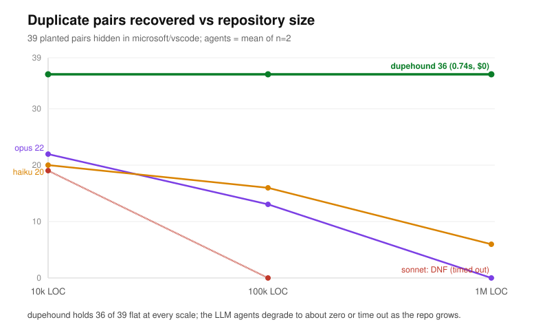

# Benchmark: structural duplicate detection vs. LLM agents on large codebases

We measured how well a deterministic duplicate-function detector (dupehound) and
autonomous LLM agents (Claude Haiku 4.5, Sonnet 4.6, Opus 4.8) recover known
duplicate functions planted in a real codebase, as a function of repository size
(10k to 1,000,017 lines). For each system we recorded recall (by clone type),
wall-clock time, token usage, and cost.

Summary of results: dupehound recovered 36 of 39 planted pairs at every size in
under 0.75 s with no per-run variance and zero false positives. The agents
recovered roughly half the pairs at 10k LOC and progressively fewer as the
codebase grew, reaching 0 to 6 of 39 (or timing out) at 1M LOC, while using 1.5 to 28 M
input tokens and 3 to 15 minutes per run, with large run-to-run variance.

## Scope

The task is detection of duplicated functions in a source tree. We compare a
structural detector against LLM agents given file-system tools, and we vary
repository size to see how each scales. We do not evaluate semantic-equivalence
(Type-4) detection beyond reporting it, since it is undecidable in general.

## Method

Ground truth is established by planting: a fixed set of duplicate functions is
inserted into real source, so every true pair is known. A planted group is a set
of copies of one donor function; within-group pairs are duplicates, cross-group
pairs are not.

The planted set reflects how duplication occurs in practice, mostly
copy-paste-then-rename, so the corpus is weighted toward Type-2 (renamed) clones:

- 39 pairs across 42 functions: Type-1 (exact) = 3, Type-2 (renamed) = 30,
 Type-3 (renamed + small edits) = 3, Type-4 (semantic rewrite) = 3.
- Each planted function is placed in its own file under a realistic identifier and
 scattered through the host tree. Renamed clones share no identifier or function
 name with their original.

### Examples of planted pairs

The actual planted code for one pair of each type (from the 10k slice).

Type-1 (exact copy): identical body and name, in two different files.

```ts
// src/vs/base/browser/encoder.ts   and   src/vs/emitter.ts (identical)
function mergeSorted(left: number[], right: number[]): number[] {
 const merged: number[] = [];
 let i = 0; let j = 0;
 while (i < left.length && j < right.length) {
  if (left[i] <= right[j]) { merged.push(left[i]); i += 1; }
  else { merged.push(right[j]); j += 1; }
 }
 return merged.concat(left.slice(i)).concat(right.slice(j));
}
```

Type-2 (renamed copy-paste): same structure; the function name, every identifier,
and the literals differ. A name search does not link the two.

```ts
// src/inspector.ts
function encodeValue(tail: any[], buffer: number): number {
 let rows = 0;
 for (const delta of tail) {
  rows += delta["k9137"] * delta["k8474"];
 }
 const echo = rows * buffer;
 return rows + echo;
}

// src/vs/base/browser/ranker.ts
function mergeRanges(foxtrot: any[], tmp: number): number {
 let res = 0;
 for (const echo of foxtrot) {
  res += echo["k3478"] * echo["k9791"];
 }
 const delta = res * tmp;
 return res + delta;
}
```

Type-3 (renamed + small edits): a renamed copy with a few inserted/changed lines
(here two `audit` locals added, lowering structural similarity).

```ts
// src/vs/base/browser/merger.ts
function resolveReference(lo: () => any, buffer: number): any {
 let mid = 8;
 for (let cols = 0; cols < buffer; cols++) {
  try { return lo(); }
  catch (tmp) { if (cols === buffer - 8) throw tmp; mid = mid * 1; }
 }
 return null;
}

// src/parser.ts
function sanitizeText(hotel: () => any, win: number): any {
 const audit0 = 3;  // inserted
 const audit1 = 10; // inserted
 let store = 1;
 for (let ptr = 0; ptr < win; ptr++) {
  try { return hotel(); }
  catch (count) { if (ptr === win - 1) throw count; store = store * 3; }
 }
 return null;
}
```

Type-4 (semantic rewrite): same behavior (sum of squares), different control
structure (`for` loop vs `reduce`).

```ts
// src/vs/inspector1.ts
function hashContent(node: number[]): number {
 let vals = 0;
 for (const data of node) vals += data * data;
 return vals;
}

// src/ranker1.ts
function annotateRange(lo: number[]): number {
 return lo.reduce((a, step) => a + step ** 2, 0);
}
```

Scoring is at the function-pair level. A reported/detected pair is matched to a
planted pair by `(file, function name)`. We report precision, recall, recall by
clone type, and full per-run telemetry.

The agents were run headless (`claude -p`) with read-only tools (glob, grep,
read), an identical prompt, and isolation: no MCP servers (so the agent cannot
call dupehound), no shell, no sub-agents, no access to the ground-truth file. We
audited the tool calls of sampled runs to confirm the isolation held.

## Setup

- Host: `microsoft/vscode` at commit `dac0f5b39188986a409f25916f136377ce141e85`.
 The full repository at this commit is 5,087,034 lines across 16,026 tracked
 files, including 3,305,184 lines of TypeScript (.ts/.tsx, excluding .d.ts;
 2,247,827 of them non-test). We index four core source directories
 (`src/vs/base`, `src/vs/editor`, `src/vs/platform`, `src/vs/workbench`),
 totalling 1,494,689 non-test TypeScript lines, and build slices from them by
 line count.
- Slices (host LOC / files): 10,071 / 39; 100,101 / 312; 500,023 / 2,256;
 1,000,017 / 3,662. The same 39 pairs are planted into each. Line counts are
 physical lines (newline-terminated), the same convention used throughout.
- TypeScript averages ~10 tokens/line, so the slices are ~97k / 932k / 5.3M / 10M
 tokens. The 500k and 1M slices exceed a 1M-token context window; the agent must
 search the tree with tools rather than read it.
- dupehound v0.1.0, threshold 0.80, min-tokens 20, run 5× per slice.
- Agents: Haiku 4.5, Sonnet 4.6, Opus 4.8; 2 runs per (model, slice) on the
 10k/100k/1M slices; up to 150 turns and a 900 s wall-clock cap per run;
 concurrency 2.
- Cost is the API-equivalent figure reported by the CLI; the runs used a Max
 subscription, so real cost was $0. Token counts are exact. Seed 7.

## Results

Pairs recovered (of 39). Agent values are the mean of n=2; "DNF" means every run
of that cell reached the time or turn limit without returning a result.

| system | 10k | 100k | 500k | 1M | time at 1M | cost at 1M |
|---|---|---|---|---|---|---|
| dupehound | 36 | 36 | 36 | 36 | 0.74 s | $0 |
| Haiku | 20 | 16 | n/a | 6 | 276 s | $0.65 |
| Opus | 22 | 13 | n/a | 0 | 820 s | $2.54 |
| Sonnet | 19 | 0 | n/a | DNF | DNF | DNF |

(Agent figures are the mean of two runs; 500k was run for dupehound only. Cost is the run's cumulative API-equivalent figure; on the Max subscription out-of-pocket was $0. Each agent run also processed several million input tokens; see the per-run section below.)



Recall on Type-2 (renamed) clones, which are 30 of the 39 pairs:

| system | 10k | 100k | 1M |
|---|---|---|---|
| dupehound | 30/30 | 30/30 | 30/30 |
| Opus | 18/30 | 9/30 | 0/30 |
| Haiku | 16/30 | 13/30 | 4/30 |
| Sonnet | 16/30 | 0/30 | DNF |

Recall by clone type (recovered / planted):

| system | size | T1 (3) | T2 (30) | T3 (3) | T4 (3) |
|---|---|---|---|---|---|
| dupehound | 10k to 1M | 3 | 30 | 3 | 0 |
| Haiku | 10k | 3 | 16 | 0 | 0 |
| Haiku | 100k | 2 | 13 | 2 | 0 |
| Haiku | 1M | 0 | 4 | 0 | 2 |
| Opus | 10k | 3 | 18 | 0 | 0 |
| Opus | 100k | 3 | 9 | 1 | 0 |
| Opus | 1M | 0 | 0 | 0 | 0 |
| Sonnet | 10k | 3 | 16 | 0 | 0 |
| Sonnet | 100k | 0 | 0 | 0 | 0 |
| Sonnet | 1M | DNF | DNF | DNF | DNF |

dupehound holds Type-1/2/3 flat across all sizes and does not detect Type-4 (by
design). Neither approach detects Type-4 reliably.

### Per-run variance

Aggregates hide large variance between otherwise-identical agent runs:

| model | slice | run A | run B |
|---|---|---|---|
| Haiku | 100k | 0/39 | 33/39 |
| Opus | 10k | 12/39 | 31/39 |
| Haiku | 1M | 12/39 | 0/39 |

dupehound returned the same 36/39 on every repeat.

## Why recall degrades with size

A renamed clone shares no identifier or function name with its original, so a name
search (grep) does not find it; detecting it requires reading and comparing
function bodies. At 1M LOC (~10M tokens, 3,662 files) an agent reads under ~1% of
files within the budget, so most planted clones are never seen. dupehound
normalizes identifiers and literals before fingerprinting, so a renamed copy
produces the same fingerprints as its original and is matched regardless of where
it sits or how many files there are.

## Cost and latency

Across the agent grid: ~150 M input tokens for a notional ~$22 (real $0 on the
subscription; on metered API pricing this is real cost). Per run: $0.34 to $3.38,
1.5 to 28 M input tokens, 3 to 15 minutes. Of 16 completed agent runs, 6 hit the time or
turn limit (DNF), concentrated at 100k to 1M.

Extrapolating from the 1M-slice token rate (~13,500 input tokens per 1k LOC), a
single agent pass over the full 1,494,689-LOC corpus is ~$1 to 2 notional and tens of
minutes. dupehound scans the same corpus in under 2 s for $0.

## Determinism and false positives

dupehound produced 0 false positives across the 15,000+ real functions present in
the largest slice (it flagged none of them as a planted clone), and identical
output on every repeat. The agents are non-deterministic and, as shown above,
varied widely run to run; several runs did not finish.

## Implications

For Type-1/2/3 duplication (exact, renamed, lightly edited, the common cases),
deterministic structural detection is both sufficient and substantially cheaper,
faster, and more reliable than an LLM agent, and the gap widens with repository
size. The LLM's only observed advantage is occasional recovery of Type-4
(semantic) clones, which the structural detector does not target.

A practical division of labor follows: run the structural pass first (it covers
the bulk deterministically and for free), and use an LLM only for the semantic
residual. dupehound exposes an MCP server so an agent can invoke the structural
pass directly rather than reimplementing it.

## Limitations

- Only Claude agents were measured. A GPT arm exists in the harness but was not
 run (OpenAI account quota exhausted). This is dupehound vs. Claude agents, not
 vs. all models.
- Different scaffolds: the Claude agents use their own CLI agent loop; a
 cross-provider study should use one identical tool loop for all models.
- n = 2 per agent cell. The variance is large relative to n; tighter intervals
 require more runs.
- DNF reflects a 15-minute / 150-step budget, not model incapacity; a larger
 budget would convert some DNFs into slower, costlier completions.
- Synthetic Type-4 is a small hand-authored set; Type-4 figures are indicative
 only.
- Per-run telemetry (the variance table) is reconstructed from session
 transcripts; per-cell aggregates are cross-checked against the run's report.

## Reproduce

Deterministic from a fixed seed against a pinned commit:

```
# dupehound on every slice (free)
python3 benchmarks/harness/run_scaling.py --no-agent

# the agent grid
python3 benchmarks/harness/run_scaling.py \
  --models haiku sonnet opus --agent-targets 10000 100000 1000000 --agent-runs 2

# per-run telemetry reconstruction
python3 benchmarks/harness/granular.py
```

Host `microsoft/vscode @ dac0f5b39188986a409f25916f136377ce141e85`,
1,494,689 LOC available; 39 planted pairs, seed 7; dupehound v0.1.0.
